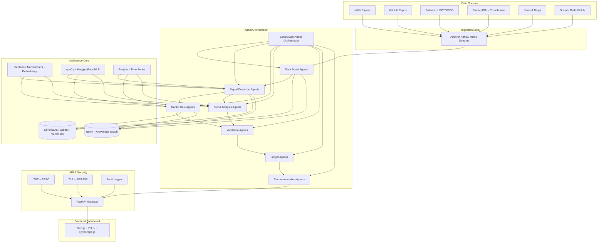
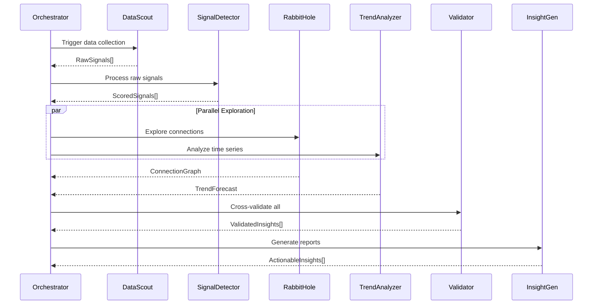
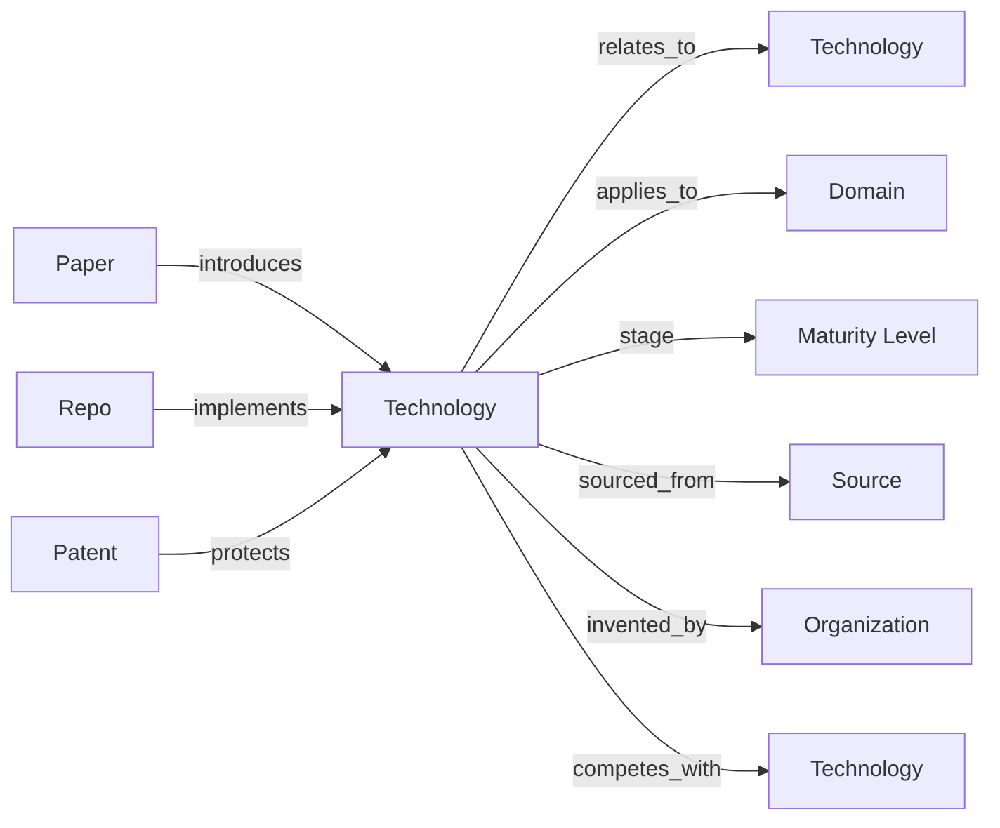
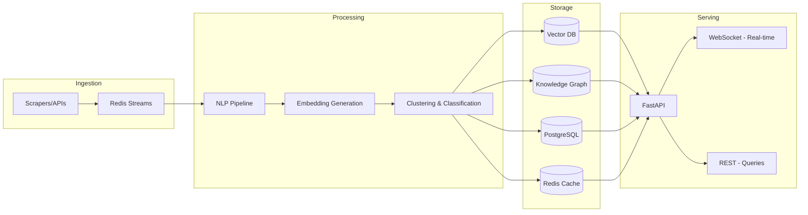

# Sanskriti — Agentic AI Innovation Intelligence Platform

> A VC-grade, real-time technology intelligence system that thinks like a research analyst, explores like a curious scientist, filters like a signal processing engine, and presents like a world-class dashboard.

---

## 1. System Overview

**Sanskriti** is a multi-agent, real-time intelligence platform that continuously scans research papers, GitHub repos, patents, startup databases, news, and social media to detect **emerging technologies before they become mainstream**. It uses graph-based "rabbit hole" exploration, robust signal-vs-noise filtering, and produces actionable, explainable insights through a premium interactive dashboard.

### Core Capabilities
| Capability | Description |
|---|---|
| **Signal Detection** | Identify weak, early signals with novelty/velocity/credibility scoring |
| **Noise Filtering** | Hype detection, dedup, spam filtering, fake-signal adversarial defense |
| **Rabbit Hole Exploration** | Graph-based multi-hop reasoning across domains |
| **Domain Classification** | AI, Cybersecurity, AR/VR, Robotics, IoT with maturity & opportunity scores |
| **Real-Time Dashboard** | Technology radar, signal explorer, rabbit hole graph, heatmaps, alerts |
| **Explainable AI** | Every insight includes reasoning chain and evidence trail |

---

## 2. Full Architecture



### Technology Decisions

| Layer | Technology | Justification |
|---|---|---|
| **Frontend** | Next.js 14 + TypeScript | SSR, API routes, React ecosystem |
| **Visualization** | D3.js + Cytoscape.js + Recharts | Graph viz, radar charts, heatmaps |
| **Backend API** | FastAPI (Python) | Async, fast, auto-docs, ML ecosystem |
| **Agent Framework** | LangGraph + LangChain | Stateful multi-agent orchestration |
| **Vector DB** | ChromaDB (MVP) → Qdrant (scale) | Semantic search, embedding storage |
| **Knowledge Graph** | NetworkX (MVP) → Neo4j (scale) | Relationship traversal, rabbit holes |
| **Embeddings** | all-MiniLM-L6-v2 | Fast, accurate, runs locally |
| **NLP** | spaCy + HuggingFace transformers | NER, classification, topic modeling |
| **Streaming** | Redis Streams (MVP) → Kafka (scale) | Real-time event ingestion |
| **Time Series** | Prophet + statsmodels | Trend forecasting |
| **Auth** | NextAuth.js + JWT | RBAC, session management |
| **Database** | PostgreSQL + Redis | Persistent storage + caching |
| **Deployment** | Docker Compose (MVP) → K8s (scale) | Container orchestration |

---

## 3. Agent Design

### 3.1 Agent Architecture Pattern

Each agent follows a **ReAct (Reason + Act)** pattern with shared memory:

```
┌─────────────────────────────────────────┐
│            Agent Orchestrator           │
│         (LangGraph StateGraph)          │
├─────┬──────┬──────┬──────┬──────┬──────┤
│Scout│Signal│Rabbit│Trend │Valid.│Insight│
│Agent│Agent │Hole  │Agent │Agent │Agent  │
│     │      │Agent │      │      │       │
└──┬──┴──┬───┴──┬───┴──┬───┴──┬───┴──┬────┘
   │     │      │      │      │      │
   ▼     ▼      ▼      ▼      ▼      ▼
┌─────────────────────────────────────────┐
│         Shared Memory Layer             │
│  Vector DB │ Knowledge Graph │ Redis    │
└─────────────────────────────────────────┘
```

### 3.2 Agent Specifications

#### A. Data Scout Agents
- **Sources**: arXiv API, GitHub REST/GraphQL, USPTO PatentsView, Crunchbase, NewsAPI, Reddit API, HN Firebase API
- **Output**: Normalized `RawSignal` objects with source, timestamp, content, metadata
- **Scheduling**: Every 15 min (GitHub/HN), hourly (arXiv/patents), daily (Crunchbase)

#### B. Signal Detection Agents
- **Scoring Formula**:
  ```
  signal_score = (novelty × 0.30) + (velocity × 0.25) + (credibility × 0.25) + (cross_source × 0.20)
  ```
- **Novelty**: Inverse document frequency against existing knowledge base
- **Velocity**: Rate of mention growth over 7/30/90 day windows
- **Credibility**: Source authority weight (arXiv=0.9, GitHub=0.85, Patent=0.95, News=0.6, Reddit=0.4)
- **Cross-Source**: Number of independent sources confirming signal

#### C. Rabbit Hole Agents
- **Graph Traversal**: BFS with relevance pruning (max depth=5, min edge weight=0.3)
- **Semantic Linking**: Cosine similarity > 0.65 between embeddings creates graph edges
- **Multi-Hop Example**: `"neuromorphic chip" → "spiking neural networks" → "edge inference" → "autonomous drones"`
- **Loop Prevention**: Visited-node tracking + diminishing relevance score per hop

#### D. Trend Analysis Agents
- **Time-Series**: Prophet for trend decomposition (trend + seasonality + noise)
- **Breakout Detection**: Statistical change-point detection (CUSUM algorithm)
- **Maturity Classification**: Based on signal volume + diversity + time-since-first-signal

#### E. Validation Agents
- **Cross-Reference**: Verify claims across ≥2 independent sources
- **Fake Signal Detection**: Anomaly detection on signal patterns (sudden spikes from single source = suspicious)
- **Credibility Scoring**: Weighted source reliability + author h-index (papers) + repo stars/forks ratio

#### F. Insight Agents
- **Summary Generation**: Template-based + LLM-enhanced narrative generation
- **Business Impact**: Market size estimation, competitive landscape, entry barriers
- **Evidence Chain**: Linked citations to original sources

#### G. Recommendation Agents
- **Startup Ideas**: Gap analysis between technology capability and market need
- **Investment Signals**: Risk-adjusted opportunity scoring
- **Use Case Generation**: Domain-specific application suggestions

### 3.3 Agent Communication



---

## 4. Signal vs Noise Framework

### Signal Scoring Engine

```python
class SignalScorer:
    def score(self, signal: RawSignal) -> ScoredSignal:
        novelty = self._compute_novelty(signal)        # IDF against corpus
        velocity = self._compute_velocity(signal)      # Growth rate
        credibility = self._source_credibility(signal)  # Source weight
        cross_source = self._cross_validation(signal)   # Multi-source confirm
        
        composite = (
            novelty * 0.30 +
            velocity * 0.25 +
            credibility * 0.25 +
            cross_source * 0.20
        )
        
        return ScoredSignal(
            signal=signal,
            score=composite,
            classification='signal' if composite > 0.55 else 'weak_signal' if composite > 0.35 else 'noise',
            explanation=self._generate_explanation(novelty, velocity, credibility, cross_source)
        )
```

### Noise Filtering Pipeline

| Stage | Technique | Purpose |
|---|---|---|
| 1. Dedup | MinHash + LSH | Remove near-duplicate content |
| 2. Spam Filter | Trained classifier | Remove promotional/spam content |
| 3. Hype Detector | Sentiment + buzzword density | Filter hype-driven press releases |
| 4. Staleness Check | Timestamp + recency decay | Deprioritize old recycled news |
| 5. Source Validation | Authority scoring | Weight by source credibility |

### Weak Signal Detection
- **Low-frequency, high-potential**: Signals appearing in <3 sources but from high-credibility origins (arXiv, patents)
- **Cross-domain emergence**: Same concept appearing independently across unrelated domains
- **Research-to-industry bridge**: Academic papers cited by industry blog posts or GitHub repos

---

## 5. Rabbit Hole Engine

### Knowledge Graph Schema



### Exploration Algorithm

```python
def explore_rabbit_hole(start_node: str, max_depth: int = 5, min_relevance: float = 0.3):
    visited = set()
    frontier = [(start_node, 1.0, 0)]  # (node, relevance, depth)
    exploration_tree = {}
    
    while frontier:
        node, relevance, depth = heapq.heappop(frontier)  # Best-first
        if node in visited or depth > max_depth or relevance < min_relevance:
            continue
        
        visited.add(node)
        neighbors = knowledge_graph.get_neighbors(node)
        
        for neighbor, edge_weight in neighbors:
            child_relevance = relevance * edge_weight * (0.85 ** depth)  # Decay
            if child_relevance >= min_relevance:
                heapq.heappush(frontier, (neighbor, child_relevance, depth + 1))
                exploration_tree[neighbor] = {
                    'parent': node,
                    'relevance': child_relevance,
                    'depth': depth + 1,
                    'relationship': edge_weight
                }
    
    return exploration_tree
```

### Semantic Edge Creation
- Embed all technology descriptions using Sentence Transformers
- Create edges when `cosine_similarity(embed_A, embed_B) > 0.65`
- Edge weight = similarity score
- Domain-crossing edges get a novelty bonus of `+0.1`

---

## 6. Data Pipeline



### Storage Strategy

| Layer | Technology | Data | Retention |
|---|---|---|---|
| **Hot** | Redis | Active signals, alerts, session cache | 24 hours |
| **Warm** | PostgreSQL + ChromaDB | Scored signals, embeddings, agent state | 90 days |
| **Cold** | S3 / MinIO | Historical archives, raw data | Indefinite |

---

## 7. Intelligence Layer

| Component | Technology | Purpose |
|---|---|---|
| **Embeddings** | all-MiniLM-L6-v2 | Semantic understanding of all content |
| **Topic Modeling** | BERTopic | Dynamic topic discovery from signal clusters |
| **NER** | spaCy en_core_web_trf | Extract technology entities, orgs, people |
| **Classification** | Fine-tuned DistilBERT | Hype vs real innovation, domain classification |
| **Trend Forecasting** | Prophet + CUSUM | Time-series decomposition + breakout detection |
| **Graph Algorithms** | NetworkX / Neo4j | PageRank, community detection, shortest path |
| **Similarity Search** | HNSW (ChromaDB) | Fast approximate nearest neighbor for rabbit holes |

---

## 8. Interactive Dashboard Design

### Layout Architecture

```
┌──────────────────────────────────────────────────────────┐
│  🧭 SANSKRITI — Innovation Intelligence Platform         │
│  ┌─────────┐                              🔔 Alerts  👤  │
│  │ Sidebar │  ┌───────────────────────────────────────┐  │
│  │         │  │         MAIN CONTENT AREA              │  │
│  │ • Radar │  │                                       │  │
│  │ • Signal│  │  [Dynamic view based on selection]     │  │
│  │ • Rabbit│  │                                       │  │
│  │ • Trends│  │                                       │  │
│  │ • Domain│  │                                       │  │
│  │ • Alerts│  │                                       │  │
│  │ • Report│  │                                       │  │
│  └─────────┘  └───────────────────────────────────────┘  │
└──────────────────────────────────────────────────────────┘
```

### Core Views

#### 1. Technology Radar (Home)
- **Concentric rings**: Adopt → Trial → Assess → Hold
- **Quadrants**: AI, Cybersecurity, AR/VR+Robotics, IoT
- **Interactive**: Click any blip to see signal details, drag to reclassify
- **Built with**: D3.js custom radar chart

#### 2. Signal vs Noise Visualizer
- **Split view**: Left = Signals (green gradient), Right = Noise (red gradient)
- **Each card**: Technology name, score bar, source badges, explain button
- **Filters**: By domain, score threshold, time range, source
- **Score breakdown**: Expandable radar chart (novelty/velocity/credibility/cross-source)

#### 3. Rabbit Hole Explorer
- **Interactive graph**: Cytoscape.js force-directed layout
- **Click a node** → expands connected technologies with animated edges
- **Node size** = signal strength, **edge thickness** = relationship strength
- **Color coding** by domain, **opacity** by relevance depth
- **Sidebar**: Shows exploration path, evidence trail, depth control slider

#### 4. Trend Heatmaps
- **Time × Domain matrix**: Color intensity = signal volume
- **Sparklines**: Inline trend lines for each technology
- **Breakout indicators**: ⚡ badges for detected breakouts
- **Time range selector**: 7d / 30d / 90d / 1y

#### 5. Domain Dashboards
- Per-domain view (AI, Cybersecurity, AR/VR, Robotics, IoT)
- Subdomain breakdown with maturity gauge (Early → Emerging → Scaling → Saturated)
- Opportunity score + Risk level indicators
- Top signals and latest developments

#### 6. Real-Time Alerts
- WebSocket-powered live feed
- Configurable alert rules (new breakout, score threshold, domain filter)
- Toast notifications + persistent alert log

#### 7. Reports & Export
- Auto-generated PDF/Markdown reports
- Startup idea cards with market analysis
- Investment memo templates
- CSV/JSON data export

### Design System

| Element | Specification |
|---|---|
| **Theme** | Dark mode primary (glassmorphism), light mode toggle |
| **Colors** | Deep navy `#0a0f1e`, Electric blue `#3b82f6`, Emerald `#10b981`, Amber `#f59e0b`, Rose `#f43f5e` |
| **Typography** | Inter (headings), JetBrains Mono (data/code) |
| **Animations** | Framer Motion — page transitions, card reveals, graph animations |
| **Glassmorphism** | `backdrop-filter: blur(16px)`, semi-transparent cards |

---

## 9. Security Architecture

| Layer | Implementation |
|---|---|
| **Transport** | TLS 1.3 for all API communication |
| **Data at Rest** | AES-256 encryption for PostgreSQL, encrypted vector indices |
| **Authentication** | NextAuth.js with JWT (access + refresh tokens) |
| **Authorization** | RBAC: Admin, Analyst, Viewer roles |
| **API Security** | Rate limiting, CORS, input validation, API key rotation |
| **Agent Auth** | HMAC-signed inter-agent messages |
| **Data Integrity** | SHA-256 checksums on ingested data |
| **Anti-Poisoning** | Anomaly detection on data sources, source reputation tracking |
| **Fake Signal Defense** | Multi-source corroboration required (≥2 sources for signal status) |
| **Audit** | Structured logging → PostgreSQL audit table, all agent decisions logged |
| **Monitoring** | Health checks, error rates, latency dashboards (Grafana) |

---

## 10. Feature Set Summary

| Category | Features |
|---|---|
| **Detection** | Early signal detection, weak signal amplification, breakout alerts |
| **Analysis** | Signal scoring, trend forecasting, maturity classification |
| **Exploration** | Rabbit hole graphs, multi-hop reasoning, cross-domain linking |
| **Intelligence** | Explainable AI reasoning, credibility scoring, hype classification |
| **Tracking** | Competitor tracking, patent intelligence, GitHub innovation tracking |
| **Output** | Startup idea generator, investment insights, exportable reports |
| **Real-Time** | WebSocket updates, live alerts, streaming dashboard |
| **Security** | E2E encryption, RBAC, audit logs, anti-poisoning |

---

## 11. Implementation Roadmap

### Phase 1: MVP Foundation (Weeks 1-3)
> **Goal**: Working pipeline with basic dashboard

- [ ] Project scaffolding (Next.js frontend + FastAPI backend + Docker Compose)
- [ ] Data Scout agents (GitHub, HN, arXiv scrapers)
- [ ] Basic signal scoring engine
- [ ] ChromaDB vector storage + NetworkX knowledge graph
- [ ] Core dashboard: Technology radar + signal list
- [ ] Basic auth (JWT + single role)

### Phase 2: Intelligence Layer (Weeks 4-6)
> **Goal**: Smart signal detection + rabbit holes

- [ ] Full signal-vs-noise pipeline (dedup, hype filter, cross-source validation)
- [ ] Rabbit hole exploration engine with graph visualization
- [ ] BERTopic topic modeling + NER pipeline
- [ ] Trend analysis with Prophet time-series
- [ ] Domain classification (AI, Cybersecurity, AR/VR, Robotics, IoT)
- [ ] Dashboard: Signal visualizer, rabbit hole explorer, heatmaps

### Phase 3: Production Hardening (Weeks 7-9)
> **Goal**: Reliable, secure, scalable

- [ ] Redis Streams for real-time ingestion
- [ ] WebSocket real-time alerts
- [ ] Full RBAC + audit logging
- [ ] Validation agents + fake signal defense
- [ ] Report generation (PDF + Markdown)
- [ ] Performance optimization + caching layer

### Phase 4: Scale & Advanced Features (Weeks 10-12)
> **Goal**: Premium platform features

- [ ] Patent intelligence (USPTO API)
- [ ] Startup/competitor tracking (Crunchbase)
- [ ] Autonomous learning (feedback loops on predictions)
- [ ] Advanced dashboard (time-travel view, tech comparison)
- [ ] Kubernetes deployment manifests
- [ ] Monitoring + alerting (Grafana/Prometheus)

---

## 12. Tech Stack Summary

```
Frontend:     Next.js 14 + TypeScript + D3.js + Cytoscape.js + Framer Motion
Styling:      Vanilla CSS (glassmorphism dark theme) + CSS Modules
Backend:      FastAPI (Python 3.11+) + Pydantic + SQLAlchemy
Agents:       LangGraph + LangChain + Sentence Transformers
Vector DB:    ChromaDB (MVP) → Qdrant (scale)
Graph DB:     NetworkX (MVP) → Neo4j (scale)
NLP:          spaCy + BERTopic + HuggingFace Transformers
Streaming:    Redis Streams (MVP) → Apache Kafka (scale)
Database:     PostgreSQL 16 + Redis 7
Auth:         NextAuth.js + JWT + bcrypt
Deployment:   Docker Compose (MVP) → Kubernetes (scale)
Monitoring:   Structured logging + Grafana + Prometheus
```

---

## 13. Project Structure

```
sanskriti/
├── docker-compose.yml
├── frontend/                    # Next.js 14 app
│   ├── src/
│   │   ├── app/                 # App router pages
│   │   │   ├── layout.tsx
│   │   │   ├── page.tsx         # Technology Radar (home)
│   │   │   ├── signals/         # Signal vs Noise view
│   │   │   ├── rabbit-hole/     # Rabbit Hole Explorer
│   │   │   ├── trends/          # Trend Heatmaps
│   │   │   ├── domains/         # Domain dashboards
│   │   │   ├── alerts/          # Real-time alerts
│   │   │   └── reports/         # Report generation
│   │   ├── components/
│   │   │   ├── radar/           # D3.js tech radar
│   │   │   ├── graph/           # Cytoscape.js rabbit hole
│   │   │   ├── charts/          # Recharts/D3 visualizations
│   │   │   ├── signals/         # Signal cards & filters
│   │   │   └── layout/          # Shell, sidebar, header
│   │   ├── lib/                 # API client, utils, hooks
│   │   └── styles/              # CSS modules + global styles
│   └── package.json
├── backend/                     # FastAPI server
│   ├── agents/
│   │   ├── orchestrator.py      # LangGraph state machine
│   │   ├── data_scout.py        # Data collection agents
│   │   ├── signal_detector.py   # Signal scoring & filtering
│   │   ├── rabbit_hole.py       # Graph exploration agent
│   │   ├── trend_analyzer.py    # Time-series analysis
│   │   ├── validator.py         # Cross-source validation
│   │   ├── insight_generator.py # Report generation
│   │   └── recommender.py      # Startup idea generation
│   ├── core/
│   │   ├── config.py            # Settings & constants
│   │   ├── security.py          # Auth, RBAC, encryption
│   │   ├── database.py          # PostgreSQL + Redis
│   │   └── models.py            # Pydantic schemas
│   ├── intelligence/
│   │   ├── embeddings.py        # Sentence Transformer wrapper
│   │   ├── nlp_pipeline.py      # spaCy + NER
│   │   ├── topic_model.py       # BERTopic clustering
│   │   ├── signal_scorer.py     # Composite scoring engine
│   │   ├── noise_filter.py      # Dedup, spam, hype filter
│   │   └── knowledge_graph.py   # NetworkX graph operations
│   ├── api/
│   │   ├── routes/              # FastAPI route modules
│   │   ├── websocket.py         # Real-time WebSocket handler
│   │   └── middleware.py        # Auth, CORS, rate limiting
│   ├── main.py                  # FastAPI entry point
│   └── requirements.txt
└── scripts/
    ├── seed_data.py             # Initial knowledge base seeding
    └── run_pipeline.py          # Manual pipeline trigger
```

---

## 14. Future Enhancements

- **LLM Integration**: GPT-4 / Claude for advanced insight narrative generation
- **Autonomous Learning**: Reinforcement learning from analyst feedback on signal accuracy
- **Custom Alerting**: Slack/Discord/Email webhook integrations
- **API Marketplace**: External API for partners to query the intelligence layer
- **Mobile App**: React Native companion for alerts on the go
- **Collaborative Annotations**: Multi-analyst annotation and tagging system
- **Prediction Scoring**: Track prediction accuracy over time, build trust scores

---

## User Review Required

> [!IMPORTANT]
> **Scope Decision**: This is a very large system. I recommend building **Phase 1 (MVP)** first — a working pipeline with GitHub/HN/arXiv scraping, basic signal scoring, knowledge graph, and the core dashboard (radar + signals + rabbit hole explorer). This alone will be a substantial, functional product. Shall I proceed with Phase 1?

> [!IMPORTANT]
> **API Keys**: Some data sources (Crunchbase, NewsAPI, USPTO) require API keys. For the MVP, I'll focus on **free, keyless sources** (GitHub trending, HN Firebase API, arXiv API, Reddit). Do you have any API keys you'd like to integrate?

> [!IMPORTANT]  
> **LLM Usage**: The plan uses local models (Sentence Transformers, BERTopic, spaCy) for zero-cost operation. Would you like to integrate an LLM API (OpenAI/Anthropic) for richer insight generation, or keep it fully local?

## Open Questions

1. **Deployment Target**: Local Docker Compose for development, or do you want cloud deployment (AWS/GCP/Azure)?
2. **Data Freshness**: How frequently should the system scan? (Current plan: 15min for GitHub/HN, hourly for arXiv, daily for patents)
3. **User Management**: Single user (you) or multi-user with roles?
4. **Priority View**: Which dashboard view is most important to you? (Radar, Signal Explorer, Rabbit Hole, or Trend Heatmap)
